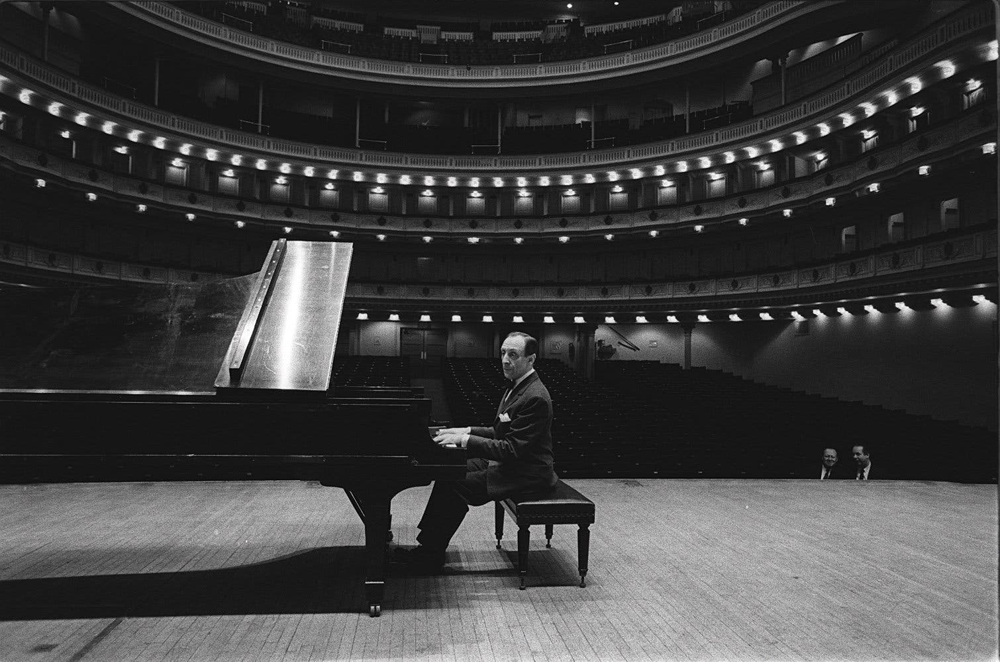

> "For me, the intellect is always the guide but not the goal of the performance. Three things have to be coordinated, and not one must stick out. Not too much intellect because it can become scholastic. Not too much heart because it can become schmaltz. Not too much technique because you become a mechanic."  
> **&mdash; Vladimir Horowitz**